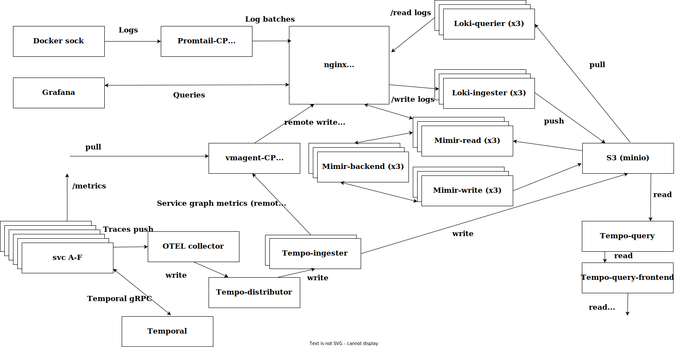
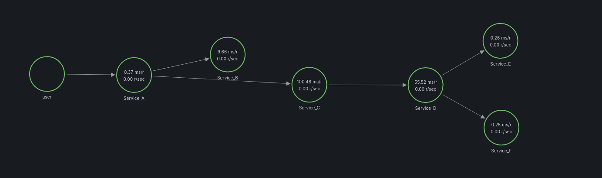

# Temporal-OTLP-example

> Still under development

Grafana stack deployment in production mode with Temporal microservices as small load generators


## How does it works?




## Deployment

```bash
make create_all # APM cluster deployment
make create_temporal # Temporal cluster deployment (UI on :8081)
make create_svc_agents # VMagent, Promtail, OTEL collector for dev and prod svc
make create_svc_dev # `Dev` test svc
make create_svc_prod # `Prod` test svc

# Do not forget to create Temporal namespaces!
docker exec -it otel-test-temporal-admin-tools bash
tctl --ad otel-test-temporal:7233 --ns dev n re
tctl --ad otel-test-temporal:7233 --ns prod n re
```

### Usage
```bash
cd apm_cluster/development
poetry shell
poetry install --no-root
python3 starter.py # Dev svc
python3 starter_prod.py # Prod svc
```

## Service graph


